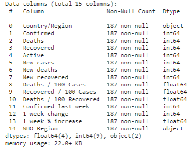
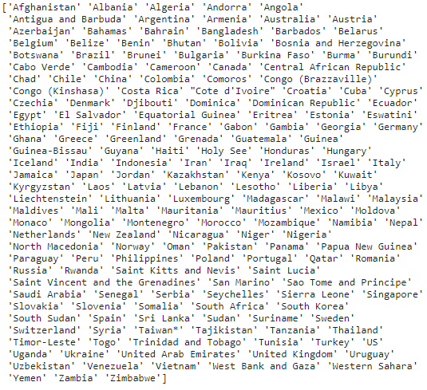
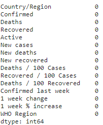
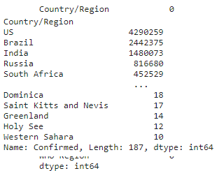
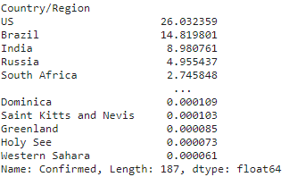
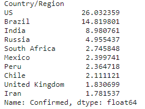
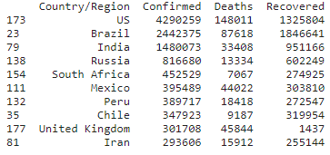
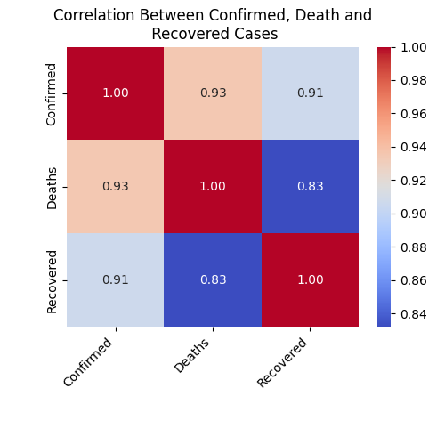
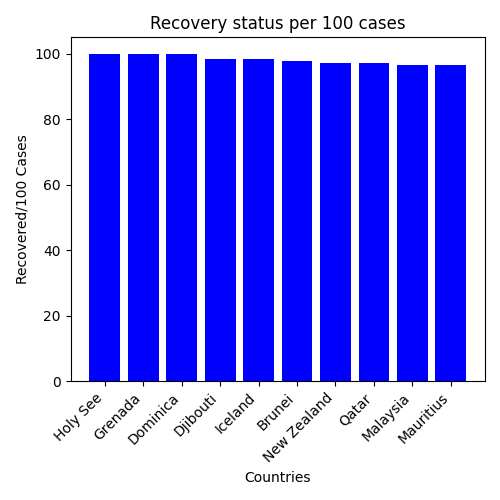
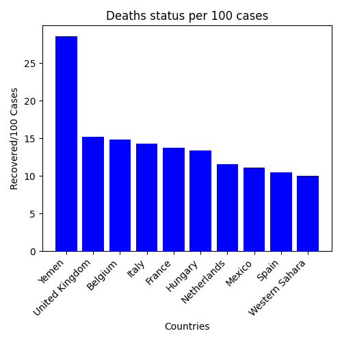

# Covid-19-Data-Analyst
https://www.kaggle.com/datasets/imdevskp/corona-virus-report

## Data Analysis Information
```
info = dataFrame.info()
print(info)
```


## Number of unique values
```
print(dataFrame['Country/Region'].nunique())
187
```
## Number of unique values list
```
print(dataFrame['Country/Region'].unique())
```


## Number of null value
```
print(dataFrame.isnull().sum())
```


## Number of confirmed cases by region
```
confirmed_by_country=dataFrame.groupby('Country/Region')['Confirmed'].sum().sort_values(ascending=False)
print(confirmed_by_country
```


## Percentage of confirmed cases by region
```
percentage=confirmed_by_country / confirmed_by_country.sum()*100
print(percentage)
```


## Top 10 elements of percentage of confirmed cases by region
```
top_10_percentage=percentage.head(10)
```


## Top 10 countries with the highest number of confirmed cases, deaths and recoveries
```
sorted_data = dataFrame.sort_values(by='Confirmed',ascending=False)
top_10_countries=sorted_data.head(10)
print(top_10_countries[['Country/Region','Confirmed','Deaths','Recovered']])
```


## Percentage Distribution of Confirmed Cases by Country


## Top 10 countries with the highest confirmed cases


## Top 10 countries with the highest death cases


## Top 10 countries with the highest recovered cases


## Correlation Between Confirmed, Death and Recovered Cases


## Recovery status per 100 cases


## Deaths status per 100 cases



