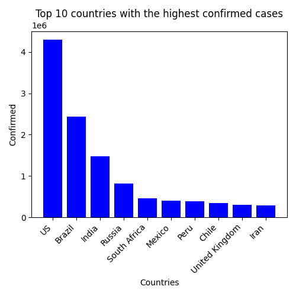
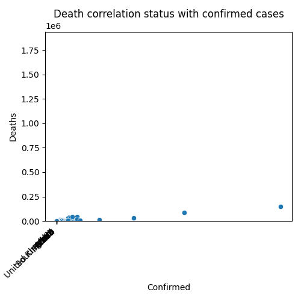

# Covid-19-Data-Analyst
https://www.kaggle.com/datasets/imdevskp/corona-virus-report

## Percentage Distribution of Confirmed Cases by Country

## Top 10 countries with the highest confirmed cases

## Top 10 countries with the highest death cases

## Top 10 countries with the highest recovered cases

## Death correlation status with confirmed cases

## Recovered correlation status with confirmed cases

## Recovery status per 100 cases

## Deaths status per 100 cases

